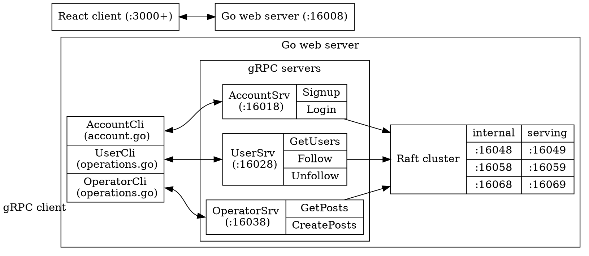

# Topics

## Group member:
Yusung Lin (me)

## Architecture



```bash
project_root/
    frontend/     # react frontend client
    internal/
        auth/     # (obsolete)
        pkg/db/   # mysql migration / configuration
        pgk/jwt/  # authentication / hashing
        pkg/raft/ # raft submodule
    web/
        account/  # gRPC server (AccountSrv)
        graph/    # (obsolete)
        post/     # gRPC server (PostSrv)
        user/     # gRPC server (UserSrv)
        server.go     # http web server
        account.go    # http handlers
        operator.go   # http handlers
        *_test.go     # go test script
        gqlgen.yml    # (obsolete)
```

I remove the *cmd/* directory because syntax of scripting language depenps heavily on the shell being use where the defaut shell for Ubuntu is *bash*, *zsh* for macOS, which I'm using *fish* which is less frequently used. Therefore, I use makefile to execute instead.

```bash
make init  # build the raft executable if not existed
make clean # clean up logs generated by raft cluster
           # in order to start with a brand new state
make start-srv # start web server
make start-cli # start web client
make stop-cli  # stop web client
make stop-srv  # stop web server
```

Also, the obsolete directories regarding graphQL are kept for future research. I gave up on those due to the insufficient understanding and unresolved bugs.

## Functionality / Features
* Create account
* Login system Authentication
* Follow/unfollow other users
* Create posts
* View posts by following users

## Testing
There are default configuration/state as the raft cluster begins. Therefore, in order to correctly perform the unit test, we have to clear up the previous state and have the web server running.

```bash
make clean
make start-srv &
cd web
go test
make stop-srv
```


## Replication scenarios
* when multiple accessing different servers
* when one server is down

## Manipulating raft cluster

```bash
1. First comment out the section of raft cluster
   (using one-key block comment by removing first '/' at line 46).
2. Next, we need 4 sessions/terminals

./raft --id 1 --cluster http://127.0.0.1:16048,http://127.0.0.1:16058,http://127.0.0.1:16068 --port 16049
./raft --id 2 --cluster http://127.0.0.1:16048,http://127.0.0.1:16058,http://127.0.0.1:16068 --port 16059
./raft --id 3 --cluster http://127.0.0.1:16048,http://127.0.0.1:16058,http://127.0.0.1:16068 --port 16069
make start-srv

3. The experiment is shown using the frontend client

make start-cli
```

* 3-node Raft cluster
* Work when 1 node is down
    ```bash
    # terminate either session
    ```
* Fail when 2 nodes are down
    ```bash
    # terminate another session
    ```

## Problems
* go build/test failure due to trashed/corrupted package library path/arrangement

    ```bash
    _cgo_export.c:3:10: fatal error: 'stdlib.h' file not found in module
    ```

    ```bash
    /usr/local/include/
    /usr/local/opt/<3rd-party-lib>/include/
    /opt/homebrew/include/
    /Library/Developer/CommandLineTools/usr/include/
    /Library/Developer/CommandLineTools/SDKs/MacOSX.sdk/usr/include/
    ```

    ```bash
    brew install zlib
    # export PATH=/usr/local/opt/zlib/lib:/usr/local/opt/zlib/include:$PATH
    set -gx PATH /usr/local/opt/zlib/lib /usr/local/opt/zlib/include $PATH
    ```

* cors problem
    * curl / postman
* debugging...

## Learned
    * React / Fetch API
    * graphQL (despite given up)
    * gRPC
    * Raft mechanism
    * Linux is better platform for development
    * go test
    * the concept of microservice
    * the merits of design pattern for unit test
